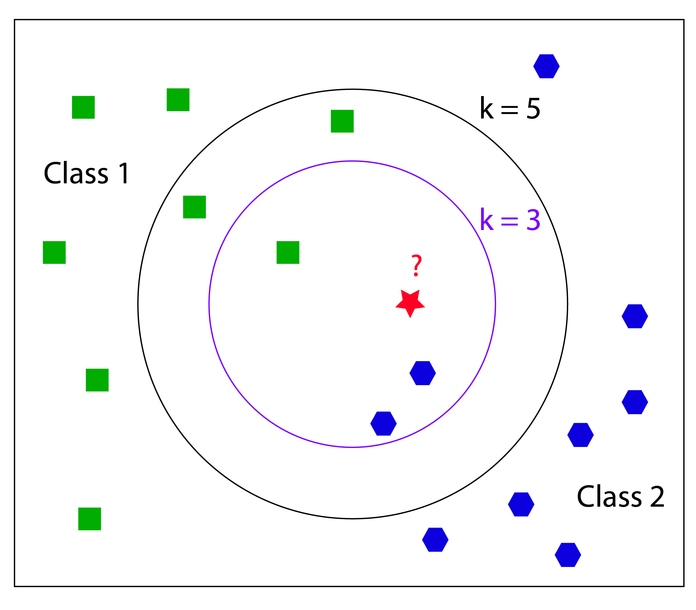
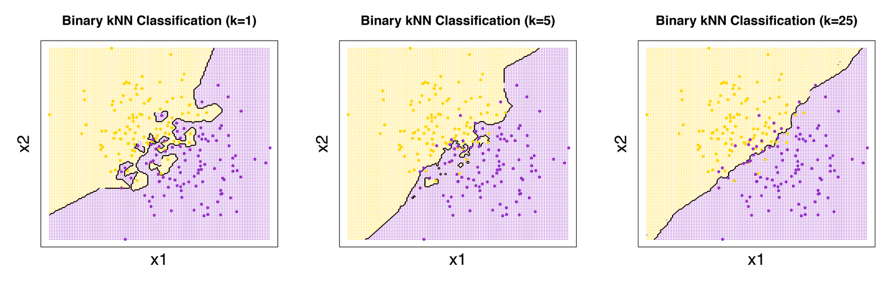
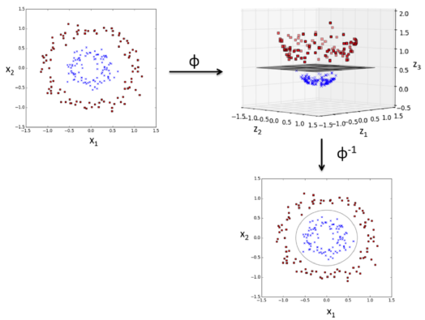

```{r global_options, echo=FALSE}
knitr::opts_chunk$set(warning=FALSE, message=FALSE)
```

## K-Nearest Neigbors Algorithm

```{r, out.width = "500px", echo=FALSE, fig.align='center'}

```

## Coded Examples - Iris Dataset

```{r echo=TRUE}
data(iris)
index <-1:nrow(iris)
test.data.index <-sample(index, trunc(length(index)/4))
test.data <- iris[test.data.index,]
train.data <-iris[-test.data.index,]

training <- as.matrix(train.data[,1:4])
rownames(training) <- NULL
train.labels <- as.integer(train.data[,5])

test <- as.matrix(test.data[,1:4])
rownames(test) <- NULL
test.labels <- as.integer(test.data[,5])
```


## Overview

- a nonparametric lazy supervised learning method
    - does not make any assumptions about data distribution
    - does not require an explicit learning phase for generalization 
    - keeps all training examples in memory

- finds k training examples closest to x and returns 
    - the majority label (through 'votes'), in case of classification 
    - the median or mean, in case of regression
  

## Number of Neighbors

If k = 1, then the new instance is assigned to the class where its nearest neighbor. 

If we give a small (large) k input, it may lead to over-fitting (under-fitting).
To choose a proper k-value, one can count on cross-validation or bootstrapping. 

```{r, out.width = "800px", echo=FALSE}

```


## Similarity/ Distance Metrics
- knn algorithm performs:
    - computation of distance matrix
    - ranking of k most similar objects. 

    
```{r, out.width = "700px", echo=FALSE}
knitr::include_graphics("images/knn3.png")
```


## Recommended R Package: knnGarden


knnVCN	k-Nearest Neighbour Classification of Versatile Distance Version
method can be "euclidean", "maximum", "manhattan","canberra", "binary" or "minkowski"

knnMCN: Mahalanobis Distance


```{r}
library(knnGarden)
library(caret)
knnMod <- knnVCN(TrnX=training,
                 OrigTrnG=train.labels,
                 TstX=test,
                 ShowObs=TRUE,
                 K=5,
                 method="minkowski",
                 p = 3)
```


## Iris Dataset - Perfect Accuracy

```{r}
test.predicted <- knnMod$TstXIBelong

test.predicted <- as.integer(ifelse(test.predicted == 1,1,
                                   ifelse(test.predicted == 2,2,
                                          3)))
xtab <- table(test.predicted, test.labels)
confusionMatrix(xtab)
```


## Advantages & Disadvantages 

- Strengths
    - cost of the learning process is zero
    - nonparametric, which means that you do not have to make the assumption of data distribution

- Drawbacks
    - Doesn't handle categorical features well, requires label encoding
    - Expensive computation for a large dataset
    - Suffers curse of dimensionality


## Other Packages

- caret
- class
- kknn
- FastKNN
- KernelKnn
- philentropy

- Python: sklearn.neighbors   
KNeighborsClassifier (n_neighbors, p, metric) 


## Support Vector Machines

```{r, out.width = "550px", echo=FALSE}
knitr::include_graphics("images/svm1.png")
```


## Overview

- Black box method
    - applicable to both supervised regression and classification problems
    -	Involves optimally separating (maximal margin) hyperplanes 
        - in d-dimensional space, a hyperplane is a d-1 dimensional separator
    - For non-separable cases, a non-linear mapping transforms the data into a kernel-induced feature space F, and then a linear machine is used to classify them in the feature space

## SVM Applications

- Bioinformatics 
    - Protein Structure Prediction
    - Breast Cancer Diagnosis
    
- Computer vision
    - Detecting Steganography in digital images
    - Intrusion Detection
    - Handwriting Recognition

- Computational linguistics


## Origins

- invented by Boser, Guyon and Vapnik, and first introduced at the Computational Learning Theory (COLT) 1992 conference.
- idea of soft margin, which allows misclassified examples, was suggested by Corinna Cortes and Vladimir N. Vapnik in 1995
- machine learning foundations from the 1960s
    - large margin hyperplanes in the input space were discussed for example by Duda and Hart, Cover, Vapnik et al.
    - the use of kernels was proposed by Aronszajn, Wahba, Poggio
    - in 1964, Aizermann et al. introduced the geometrical interpretation of the kernels as inner products in a feature space


## Soft vs. Hard Margins

Allow some misclassification by introducing a slack penalty variable ($\xi$). T

```{r, out.width = "600px", echo=FALSE}
knitr::include_graphics("images/svm5.png")
```

## Cost Penalty

The slack variable is regulated by hyperparameter cost parameter C. 
    - when C=0, there is a less complex boundary    
    - when C=inf, more complex boundary, as algorithms cannot afford to misclassify a single datapoint (overfitting)

```{r, out.width = "800px", echo=FALSE}
knitr::include_graphics("images/svm6.png")
```


## SVM with Low Cost Parameter

To create a soft margin and allow some misclassification, we use an SVM model with small cost (C= 1) 

```{r eval=FALSE}
library(e1071)
iris.subset <- iris[iris$Species %in% c("setosa","virginica"),][c("Sepal.Length", "Sepal.Width", "Species")]
svm.model = svm(Species ~ ., data=iris.subset, kernel='linear', cost=1, scale=FALSE)
plot(x=iris.subset$Sepal.Length,y=iris.subset$Sepal.Width, col=iris.subset$Species, pch=19)
points(iris.subset[svm.model$index,c(1,2)],col="blue",cex=2) #The index of the resulting support vectors in the data matrix.
w = t(svm.model$coefs) %*% svm.model$SV
b = -svm.model$rho
abline(a=-b/w[1,2], b=-w[1,1]/w[1,2], col="red", lty=5)
```


## Support vectors circled with separation line (Low Cost Parameter)

To create a soft margin and allow some misclassification, we use an SVM model with small cost (C= 1) 

```{r echo=FALSE}
library(e1071)
iris.subset <- iris[iris$Species %in% c("setosa","virginica"),][c("Sepal.Length", "Sepal.Width", "Species")]
svm.model = svm(Species ~ ., data=iris.subset, kernel='linear', cost=1, scale=FALSE)
plot(x=iris.subset$Sepal.Length,y=iris.subset$Sepal.Width, col=iris.subset$Species, pch=19)
points(iris.subset[svm.model$index,c(1,2)],col="blue",cex=2) #The index of the resulting support vectors in the data matrix.
w = t(svm.model$coefs) %*% svm.model$SV
b = -svm.model$rho
abline(a=-b/w[1,2], b=-w[1,1]/w[1,2], col="red", lty=5)
```


## SVM with High Cost Parameter

```{r eval=FALSE}
svm.model = svm(Species ~ ., data=iris.subset, type='C-classification', kernel='linear', cost=10000, scale=FALSE)
plot(x=iris.subset$Sepal.Length,y=iris.subset$Sepal.Width, col=iris.subset$Species, pch=19)
points(iris.subset[svm.model$index,c(1,2)],col="blue",cex=2)
w = t(svm.model$coefs) %*% svm.model$SV
b = -svm.model$rho #The negative intercept.
abline(a=-b/w[1,2], b=-w[1,1]/w[1,2], col="red", lty=5)
```

## Support vectors circled with separation line (High Cost Parameter)

```{r echo=FALSE}
svm.model = svm(Species ~ ., data=iris.subset, type='C-classification', kernel='linear', cost=10000, scale=FALSE)
plot(x=iris.subset$Sepal.Length,y=iris.subset$Sepal.Width, col=iris.subset$Species, pch=19)
points(iris.subset[svm.model$index,c(1,2)],col="blue",cex=2)
w = t(svm.model$coefs) %*% svm.model$SV
b = -svm.model$rho #The negative intercept.
abline(a=-b/w[1,2], b=-w[1,1]/w[1,2], col="red", lty=5)
```


## SVM Classification Plot

```{r echo=FALSE}
model.iris = svm(Species~., train.data, type='C-classification', kernel='linear', cost=10000, scale=TRUE)
plot(model.iris, train.data, Petal.Width ~ Petal.Length, slice = list(Sepal.Width = 3, Sepal.Length = 4))
```

Within the scatter plot, the X symbol shows the support vector and the O symbol represents the data points. These two symbols can be altered through the configuration of the svSymbol and dataSymbol options. Both the support vectors and true classes are highlighted and colored depending on their label (green refers to viginica, red refers to versicolor, and black refers to setosa). The last argument, slice, is set when there are more than two variables. Therefore, in this example, we use the additional variables, Sepal.width and Sepal.length, by assigning a constant of 3 and 4.


## Non-Linear Cases -- Theory 

Cover's Theorem (Thomas M. Cover (1965):  given any random set of finite points, then with high probability these points can be made linearly separable by mapping them to a higher dimension.


```{r, out.width = "500px", echo=FALSE}

```


## Kernel Trick

All kernel functions take two feature vectors as parameters and return the scalar dot (inner) product of the vectors. Have property of symmetry and is positive semi-definite.

By performing convex quadratic optimization, we may rewrite the algorithm so that it is independent of transforming function $\phi$ 


```{r, out.width = "800px", echo=FALSE}
knitr::include_graphics("images/svm7.png")
```

## Choice of Kernel in kernlab (I)

```{r, out.width = "800px", echo=FALSE}
knitr::include_graphics("images/svm8.png")
```


## Choice of Kernel in kernlab (II)

```{r, out.width = "800px", echo=FALSE}
knitr::include_graphics("images/svm9.png")
```


## Model Tuning (Cost & Gamma)

- One can tune hyperparameters (cost and gamma) using tune.svm() in e1071 and train() in caret

- For the gamma argument, 
    - the default value is equal to (1/data dimension), and 
    - it controls the shape of the separating hyperplane. 
    - Increasing the gamma argument usually increases the number of support vectors.


```{r eval=FALSE}
tuned = tune.svm(Species~., data = iris.subset, gamma = 10^(-6:-1),cost = 10^(0:2))
model.tuned = svm(Species~., data = iris.subset, gamma = tuned$best.parameters$gamma, cost = tuned$best.parameters$cost)
```


## Advantages & Disadvantages 

- Strengths
    - effective in high dimensional spaces (dim > N)
    - works well with even unstructured & semi-structured data (text, images)
    - does not suffer from local optimal and multicollinearity


- Drawbacks
    - difficult to interpret the final model, variable weights, and meld with business logic
    - forcing separation of the data can easily lead to overfitting, particularly when noise is present in the data
    - choosing a "good" kernel function is not easy
    - long training time for large datasets
    

