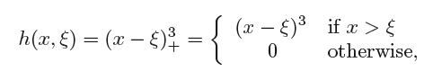

```{r global_options, echo=FALSE}
knitr::opts_chunk$set(warning=FALSE, message=FALSE)
```

# Linear vs Non-Linear Regression

- 

## Linear Regression

- 

# Linear vs Non-Linear Regression


## Non-Linear Regression


# Non-Linear Regression Models

## Neural Networks

###	Description
Ref: https://www.youtube.com/watch?v=oYbVFhK_olY

- Neural Network

 

- Deep Neural Network - Modeled by Neural network of the brain
  -	Input-Dendrite (Artificial NN Input values)
  - Nucleus (Inputs with unique weights and summed together and passed threshold in 1 to many hidden layers (neural network 1 layer, deep) neural network >1 layers)
  -	Output – Axon and terminal (Based on about becomes a 0 or 1 with Sigmoid function)
  - Transformed by a nonlinear function g()
  
  
  
  - Passthrough Synapse to next Dendrite (passed to next neuron)
  
- For P predictors there are H(P+1)+H+1 parameters
  - Fix
    -	Pre-filter the predictors
    -	Use PCA prior to modeling to eliminate correlation
    -	Increasing amount of weight decay
    
# Non-Linear Regression Models

## Neural Networks

### Calculation


- invvalue<-input1value + eachvar*weight+...
- outvalue<-1/(1+exp(-iv))
- invvalue<-input2value+ov*weight
- outvalue<-1/(1+exp(-iv2))

# Non-Linear Regression Models

## Neural Networks

### Computing examples
Ref: https://www.youtube.com/watch?v=-Vs9Vae2KI0


```{r}
# Partition and Normalize all variables to 0 and 1
library(dplyr)
data<-read.csv("covidsurv.csv", header=TRUE)
names(data)
data<-subset(data,select=(names(data[12:ncol(data)-2])))
glimpse(data)
d1<-as.data.frame(sapply(data,function(x) as.integer(x)))
d2<-as.data.frame(sapply(d1, function(x)(x-min(x)/max(x)-min(x))))
d2<-as.data.frame (sapply(d2, function(x) ifelse(x>0, 1, 0)))
d2$q03_symptoms<-as.factor(d2$q03_symptoms)
#for int (var-min(var)/max(var)-min(var))
set.seed(1234)
ind<-sample(2, nrow(d2), replace = TRUE, prob=c(.7, .3))
training<-d2[ind==1,]
testing<-d2[ind==2,]

# Create Model
library(neuralnet)
nn<-neuralnet(q03_symptoms~., data=training, hidden = 1, err.fct="ce", linear.output=FALSE) 

```


- Hidden is number of nodes/neuron in a layer, c(2,1) would be 2layers with  2 nodes/neurons and 1 nodes/neurons
- Can add lifesign= ‘full” to get all data points and rep = number of repetition times to run model. 
- When plotting with Rep can use plot(n, num) to show one with min error. Same for classification line.
- C add algorithm = one to use

# Non-Linear Regression Models

## Neural Networks

### Computing examples

```{r}
#Plot

plot(nn)
```


```{r }
#Predict
output<-compute(nn, training)
output$net.result

#Confusion Matrix
p1<- output$net.result
pred1<-ifelse(p1>.5, 1,0)
tab1<- table(pred1[1:17], training$q03_symptoms)
tab1
1-sum(diag(tab1))/sum(tab1) #missclassifications 
output<-compute(nn, testing)

p2<- output$net.result
pred2<-ifelse(p2>.5, 1,0)
tab2<- table(pred2[1:17], training$q03_symptoms)
tab2
1-sum(diag(tab2))/sum(tab2) #missclassifications
```


# Non-Linear Regression Models

## Neural Networks

### Other

- Other NN Models
  - Bayesian Framework
  - Regularization and automatic feature selection
  - Self-Organizing maps
  - Unsupervised, explanatory or supervised prediction
- Pros
  - Robust with noisy data
- Cons
  - Less interpretable
  - Need longer training times
  - Neural Networks have a tendency to over-fit the relationship between predictor and response due the large coefficients
  - Fix
    - Early stopping
    - Weight Decay with regularization with lambda values 0-.1

# Non-Linear Regression Models

## Multivariate Adaptive Regression Splines

### Description

- Creates 2 contrasted versions to of a predictor
- 1 or 2 predictors at a time
- Breaks predictors to 2 groups and models between
  - Hockey-stick(hinges)
  - Left-hand – values > 0 than cut point
  - Right-hand - values < 0 than cut point
  - Piece-wise linear model isolated portion of original data
  - Predictor/cut-point with smallest error
  - X<a, h(x − a) and h(a − x)
- Turning used to remove parameters
  - The degree of the features that are added to the model and the number of retained terms.
  - The latter parameter can be automatically determined using the default pruning procedure (using GCV), set by the user or determined using an external resampling technique
  
# Non-Linear Regression Models

## Multivariate Adaptive Regression Splines

### Description

- Types
Ref: https://www.youtube.com/watch?v=UDDXkffB-aE&t=329s
  - Linear Splines- continuous at the knot
  
  
  
  - Cubic Splines- continuous at the knot. Same as linear splines instead of power of 0 its 3.
  
  
  
  - Smoothing Splines
  
  
    - Splines without knots
    - Use smooth.splines() function in R. Does leave-one-out cross validation when smoth.spine(var, var2)with no df defined.
    - Find the function g that minimizes where λ is a nonnegative tuning parameter.
    - loess() used for Local regression. Can find local regression for range of X by weighted least square.
- Advantages
  - Model automatically conducts feature selection
  - Interpretability, each hinge feature is responsible for modeling a specific region in the predictor space using piecewise linear model.
  - MARS require very little pre-processing, transformation and filtering not needed.

# Non-Linear Regression Models

## Multivariate Adaptive Regression Splines

### Computing examples Spines
Ref: https://www.youtube.com/watch?v=u-rVXhsFyxo&t=450s

SPLINES

```{r}
#Splines

require(ISLR)
attach(Wage)
require(splines)
agelims<-range(age)
age.grid<-seq(from=agelims[1],to=agelims[2])
fit<-lm(wage~bs(age,knots=c(25,40,60)), data=Wage) #cubic polynomials
summary(fit)
plot(age, wage,col="grey")
lines(age.grid,predict(fit, list(age=age.grid)),col="darkgreen",lwd=2)
abline(v=c(25,40,60),lty=2,col="darkgreen")
fit<-smooth.spline(age, wage, df=16)#smoothing spline, degrees of freedom
lines(fit, col="red",lwd=2)
fit<-smooth.spline(age,wage,cv=TRUE)#leave one out cross validatiaon LOCV
lines(fit, col="purple", lwd=2)
fit
```

# Non-Linear Regression Models

## Multivariate Adaptive Regression Splines

### Computing examples GAM

GAM

```{r}
#GAM
require(gam)
gam1<-gam(wage~s(age,df=4)+s(year,df=4)+education,data=Wage)#s= smoothing spline
par(mfrow=c(1,3))
plot(gam1,se=T)
gam2<-gam(I(wage>250)~s(age,df=4)+s(year,df=4)+education,data=Wage,family=binomial)#GAM for logistic regression
plot(gam2)
gam2a<-gam(I(wage>250)~s(age,df=4)+year+education,data=Wage,family=binomial)
anova(gam2a, gam2, test="Chisq")#compare 2 gams with Anova

par(mfrow=c(1,3))
lm1<-lm(wage~ns(age,df=4)+education, data=Wage)#ns = natural spline
plot.Gam(lm1,se=T) # use plot.Gam to plot lm in GAM

```


# Non-Linear Regression Models

## Support Vector Machines (SVM)

# Non-Linear Regression Models

## K-Nearest Neighbors

# Non-Linear Regression Models

## Conclusion and any new insights into the future analytics (SVM)