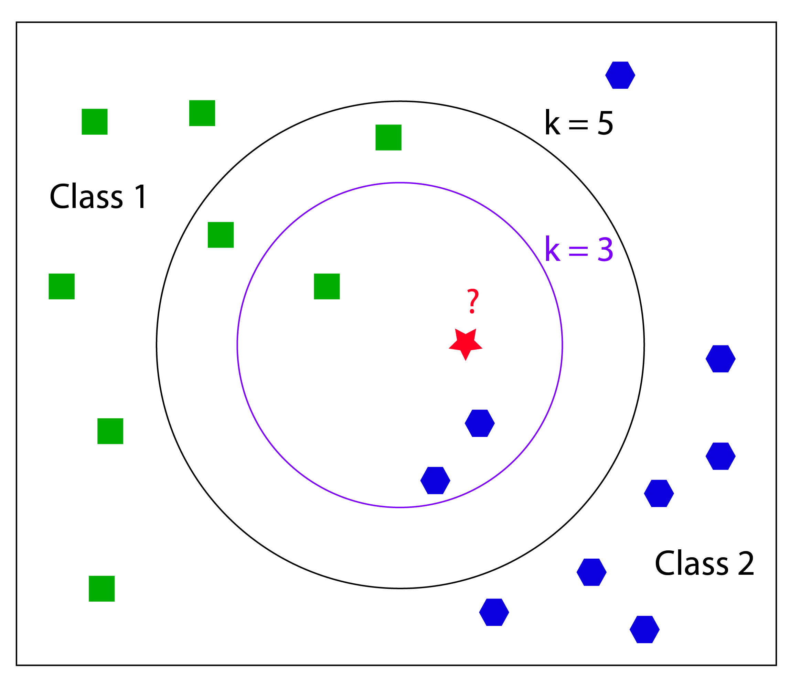
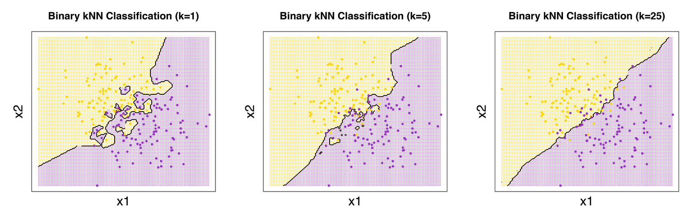

```{r global_options, echo=FALSE}
knitr::opts_chunk$set(warning=FALSE, message=FALSE)
```

# Linear Regression Review

Linear Regression model equations can be written either directly or indirectly in the form:

## $$y_i = b_0 + b_1x_{i1} + b_2x_{i2} + ... + b_Px_{iP} + e_i$$

Where:

- $y_i$ is the outcome or response
- $b_0$ is the Y-intercept
- $P$ is the number of predictor variables
- $b_1$ through $b_P$ are the coefficients or parameters of the regression
- $x_1$ through $x_P$ are the predictor variables
- $e_i$ is the prediction error term 


# Linear Regression models 

## Goal: to minimize the sum of squared errors (SSE) or a function of the sum of squared errors 

### Minimize SSE

OLS - Ordinary Least Squares

PLS - Partial Least Squares

### Minimize a function of the SSE

Penalized Models

- Ridge Regression
- Lasso
- Elastic Net


# Linear Regression Pros and Cons

## Advantages:

- They are highly interpretable
- Estimated coefficients allow for interpretation of the relationships between predictors
- Coefficient standard errors can be calculated and used to assess the statistical significance of each predictor

## Disadvantages:

- Useful only when the relationship between the predictors and the response falls along a straight line or flat hyperplane
- They may not be able to adequately capture relationships that are not linear


# Non-Linear Regression

## What to do when you suspect there is a non-linear relationship but don't know the nature of the non-linearity?

### Neural Networks (NN)

Inspired by theories about how the brain works and the interconnectedness of the neurons in the brain

### Multivariate Regression Splines (MARS)

Splits each predictor into two groups using a "hinge" or "hockey-stick" function and models linear relationships to the outcome for each group separately

### Support Vector Machines (SVM)

Aims to minimize the effect of outliers with a counter-intuitive approach that uses a subset of the training data called "support vectors" to predict new values, excluding data points closest to the regression line.

### K-Nearest Neighbors (KNN)

Predicts new values by finding the closest values from the training set predictor space and taking the mean of their response values.  K represents the number of closest values to consider.


# Neural Networks

###	Description
Ref: https://www.youtube.com/watch?v=oYbVFhK_olY

- Neural Network

 

- Deep Neural Network - Modeled by Neural network of the brain
  -	Input-Dendrite (Artificial NN Input values)
  - Nucleus (Inputs with unique weights and summed together and passed threshold in 1 to many hidden layers (neural network 1 layer, deep) neural network >1 layers)
  -	Output – Axon and terminal (Based on about becomes a 0 or 1 with Sigmoid function)
  - Transformed by a nonlinear function g()
  
  
  
  - Passthrough Synapse to next Dendrite (passed to next neuron)
  
- For P predictors there are H(P+1)+H+1 parameters
  - Fix
    -	Pre-filter the predictors
    -	Use PCA prior to modeling to eliminate correlation
    -	Increasing amount of weight decay
    


# Neural Networks

## Calculation


- invvalue<-input1value + eachvar*weight+...
- outvalue<-1/(1+exp(-iv))
- invvalue<-input2value+ov*weight
- outvalue<-1/(1+exp(-iv2))


# Neural Networks

## Computing examples
Ref: https://www.youtube.com/watch?v=-Vs9Vae2KI0


```{r}
# Partition and Normalize all variables to 0 and 1
library(dplyr)
data<-read.csv("covidsurv.csv", header=TRUE)
names(data)
data<-subset(data,select=(names(data[12:ncol(data)-2])))
glimpse(data)
d1<-as.data.frame(sapply(data,function(x) as.integer(x)))
d2<-as.data.frame(sapply(d1, function(x)(x-min(x)/max(x)-min(x))))
d2<-as.data.frame (sapply(d2, function(x) ifelse(x>0, 1, 0)))
d2$q03_symptoms<-as.factor(d2$q03_symptoms)
#for int (var-min(var)/max(var)-min(var))
set.seed(1234)
ind<-sample(2, nrow(d2), replace = TRUE, prob=c(.7, .3))
training<-d2[ind==1,]
testing<-d2[ind==2,]

# Create Model
library(neuralnet)
nn<-neuralnet(q03_symptoms~., data=training, hidden = 1, err.fct="ce", linear.output=FALSE) 

```


- Hidden is number of nodes/neuron in a layer, c(2,1) would be 2layers with  2 nodes/neurons and 1 nodes/neurons
- Can add lifesign= ‘full” to get all data points and rep = number of repetition times to run model. 
- When plotting with Rep can use plot(n, num) to show one with min error. Same for classification line.
- C add algorithm = one to use


# Neural Networks

## Computing examples

```{r}
#Plot

plot(nn)
```


```{r }
#Predict
output<-compute(nn, training)
output$net.result

#Confusion Matrix
p1<- output$net.result
pred1<-ifelse(p1>.5, 1,0)
tab1<- table(pred1[1:17], training$q03_symptoms)
tab1
1-sum(diag(tab1))/sum(tab1) #missclassifications 
output<-compute(nn, testing)

p2<- output$net.result
pred2<-ifelse(p2>.5, 1,0)
tab2<- table(pred2[1:17], training$q03_symptoms)
tab2
1-sum(diag(tab2))/sum(tab2) #missclassifications
```


# Neural Networks

## Other

- Other NN Models
  - Bayesian Framework
  - Regularization and automatic feature selection
  - Self-Organizing maps
  - Unsupervised, explanatory or supervised prediction
- Pros
  - Robust with noisy data
- Cons
  - Less interpretable
  - Need longer training times
  - Neural Networks have a tendency to over-fit the relationship between predictor and response due the large coefficients
  - Fix
    - Early stopping
    - Weight Decay with regularization with lambda values 0-.1


# Multivariate Adaptive Regression Splines

## Description

- Creates 2 contrasted versions to of a predictor
- 1 or 2 predictors at a time
- Breaks predictors to 2 groups and models between
  - Hockey-stick(hinges)
  - Left-hand – values > 0 than cut point
  - Right-hand - values < 0 than cut point
  - Piece-wise linear model isolated portion of original data
  - Predictor/cut-point with smallest error
  - X<a, h(x − a) and h(a − x)
- Turning used to remove parameters
  - The degree of the features that are added to the model and the number of retained terms.
  - The latter parameter can be automatically determined using the default pruning procedure (using GCV), set by the user or determined using an external resampling technique
  


# Multivariate Adaptive Regression Splines

## Description

- Types
Ref: https://www.youtube.com/watch?v=UDDXkffB-aE&t=329s
  - Linear Splines- continuous at the knot
  
  
  
  - Cubic Splines- continuous at the knot. Same as linear splines instead of power of 0 its 3.
  
  
  
  - Smoothing Splines
  
  
    - Splines without knots
    - Use smooth.splines() function in R. Does leave-one-out cross validation when smooth.spine(var, var2)with no df defined.
    - Find the function g that minimizes where λ is a non-negative tuning parameter.
    - loess() used for Local regression. Can find local regression for range of X by weighted least square.
- Advantages
  - Model automatically conducts feature selection
  - Interpretability, each hinge feature is responsible for modeling a specific region in the predictor space using piecewise linear model.
  - MARS require very little pre-processing, transformation and filtering not needed.


# Multivariate Adaptive Regression Splines

## Computing examples Spines
Ref: https://www.youtube.com/watch?v=u-rVXhsFyxo&t=450s

SPLINES

```{r}
#Splines

require(ISLR)
attach(Wage)
require(splines)
agelims<-range(age)
age.grid<-seq(from=agelims[1],to=agelims[2])
fit<-lm(wage~bs(age,knots=c(25,40,60)), data=Wage) #cubic polynomials
summary(fit)
plot(age, wage,col="grey")
lines(age.grid,predict(fit, list(age=age.grid)),col="darkgreen",lwd=2)
abline(v=c(25,40,60),lty=2,col="darkgreen")
fit<-smooth.spline(age, wage, df=16)#smoothing spline, degrees of freedom
lines(fit, col="red",lwd=2)
fit<-smooth.spline(age,wage,cv=TRUE)#leave one out cross validatiaon LOCV
lines(fit, col="purple", lwd=2)
fit
```


# Multivariate Adaptive Regression Splines

## Computing examples GAM

GAM

```{r}
#GAM
require(gam)
gam1<-gam(wage~s(age,df=4)+s(year,df=4)+education,data=Wage)#s= smoothing spline
par(mfrow=c(1,3))
plot(gam1,se=T)
gam2<-gam(I(wage>250)~s(age,df=4)+s(year,df=4)+education,data=Wage,family=binomial)#GAM for logistic regression
plot(gam2)
gam2a<-gam(I(wage>250)~s(age,df=4)+year+education,data=Wage,family=binomial)
anova(gam2a, gam2, test="Chisq")#compare 2 gams with Anova

par(mfrow=c(1,3))
lm1<-lm(wage~ns(age,df=4)+education, data=Wage)#ns = natural spline
plot.Gam(lm1,se=T) # use plot.Gam to plot lm in GAM

```


# K-Nearest Neighbors

```{r, out.width = "500px", echo=FALSE, fig.align='center'}

```

# K-Nearest Neighbors

## Coded Examples - Iris Dataset

```{r echo=TRUE}
data(iris)
index <-1:nrow(iris)
test.data.index <-sample(index, trunc(length(index)/4))
test.data <- iris[test.data.index,]
train.data <-iris[-test.data.index,]

training <- as.matrix(train.data[,1:4])
rownames(training) <- NULL
train.labels <- as.integer(train.data[,5])

test <- as.matrix(test.data[,1:4])
rownames(test) <- NULL
test.labels <- as.integer(test.data[,5])
```


# K-Nearest Neighbors

## Overview

- a nonparametric lazy supervised learning method
    - does not make any assumptions about data distribution
    - does not require an explicit learning phase for generalization 
    - keeps all training examples in memory

- finds k training examples closest to x and returns 
    - the majority label (through 'votes'), in case of classification 
    - the median or mean, in case of regression
  

# K-Nearest Neighbors

## Number of Neighbors

If k = 1, then the new instance is assigned to the class where its nearest neighbor. 

If we give a small (large) k input, it may lead to over-fitting (under-fitting).
To choose a proper k-value, one can count on cross-validation or bootstrapping. 

```{r, out.width = "800px", echo=FALSE}

```


# K-Nearest Neighbors

## Similarity/ Distance Metrics
- knn algorithm performs:
    - computation of distance matrix
    - ranking of k most similar objects. 

    
```{r, out.width = "700px", echo=FALSE}
knitr::include_graphics("images/knn3.png")
```


# K-Nearest Neighbors

## Recommended R Package: knnGarden


knnVCN	k-Nearest Neighbor Classification of Versatile Distance Version
method can be "euclidean", "maximum", "manhattan","canberra", "binary" or "minkowski"

knnMCN: Mahalanobis Distance


```{r}
library(knnGarden)
library(caret)
knnMod <- knnVCN(TrnX=training,
                 OrigTrnG=train.labels,
                 TstX=test,
                 ShowObs=TRUE,
                 K=5,
                 method="minkowski",
                 p = 3)
```


# K-Nearest Neighbors

## Iris Dataset - Perfect Accuracy

```{r}
test.predicted <- knnMod$TstXIBelong

test.predicted <- as.integer(ifelse(test.predicted == 1,1,
                                   ifelse(test.predicted == 2,2,
                                          3)))
xtab <- table(test.predicted, test.labels)
confusionMatrix(xtab)
```


# K-Nearest Neighbors

## Advantages & Disadvantages 

- Strengths
    - cost of the learning process is zero
    - nonparametric, which means that you do not have to make the assumption of data distribution

- Drawbacks
    - Doesn't handle categorical features well, requires label encoding
    - Expensive computation for a large dataset
    - Suffers curse of dimensionality


# K-Nearest Neighbors

## Other Packages

- caret
- class
- kknn
- FastKNN
- KernelKnn
- philentropy

- Python: sklearn.neighbors   
KNeighborsClassifier (n_neighbors, p, metric) 


# Support Vector Machines

```{r, out.width = "550px", echo=FALSE}
knitr::include_graphics("images/svm1.png")
```


# Support Vector Machines

## Overview

- Black box method
    - applicable to both supervised regression and classification problems
    -	Involves optimally separating (maximal margin) hyperplanes 
        - in d-dimensional space, a hyperplane is a d-1 dimensional separator
    - For non-separable cases, a non-linear mapping transforms the data into a kernel-induced feature space F, and then a linear machine is used to classify them in the feature space


# Support Vector Machines

## SVM Applications

- Bioinformatics 
    - Protein Structure Prediction
    - Breast Cancer Diagnosis
    
- Computer vision
    - Detecting Steganography in digital images
    - Intrusion Detection
    - Handwriting Recognition

- Computational linguistics


# Support Vector Machines

## Origins

- invented by Boser, Guyon and Vapnik, and first introduced at the Computational Learning Theory (COLT) 1992 conference.
- idea of soft margin, which allows misclassified examples, was suggested by Corinna Cortes and Vladimir N. Vapnik in 1995
- machine learning foundations from the 1960s
    - large margin hyperplanes in the input space were discussed for example by Duda and Hart, Cover, Vapnik et al.
    - the use of kernels was proposed by Aronszajn, Wahba, Poggio
    - in 1964, Aizermann et al. introduced the geometrical interpretation of the kernels as inner products in a feature space


# Support Vector Machines

## Soft vs. Hard Margins

Allow some misclassification by introducing a slack penalty variable ($\xi$). T

```{r, out.width = "600px", echo=FALSE}
knitr::include_graphics("images/svm5.png")
```


# Support Vector Machines

## Cost Penalty

The slack variable is regulated by hyperparameter cost parameter C. 
    - when C=0, there is a less complex boundary    
    - when C=inf, more complex boundary, as algorithms cannot afford to misclassify a single datapoint (overfitting)

```{r, out.width = "800px", echo=FALSE}
knitr::include_graphics("images/svm6.png")
```


# Support Vector Machines

## SVM with Low Cost Parameter

To create a soft margin and allow some misclassification, we use an SVM model with small cost (C= 1) 

```{r eval=FALSE}
library(e1071)
iris.subset <- iris[iris$Species %in% c("setosa","virginica"),][c("Sepal.Length", "Sepal.Width", "Species")]
svm.model = svm(Species ~ ., data=iris.subset, kernel='linear', cost=1, scale=FALSE)
plot(x=iris.subset$Sepal.Length,y=iris.subset$Sepal.Width, col=iris.subset$Species, pch=19)
points(iris.subset[svm.model$index,c(1,2)],col="blue",cex=2) #The index of the resulting support vectors in the data matrix.
w = t(svm.model$coefs) %*% svm.model$SV
b = -svm.model$rho
abline(a=-b/w[1,2], b=-w[1,1]/w[1,2], col="red", lty=5)
```


# Support Vector Machines

## Support vectors circled with separation line (Low Cost Parameter)

To create a soft margin and allow some misclassification, we use an SVM model with small cost (C= 1) 

```{r echo=FALSE}
library(e1071)
iris.subset <- iris[iris$Species %in% c("setosa","virginica"),][c("Sepal.Length", "Sepal.Width", "Species")]
svm.model = svm(Species ~ ., data=iris.subset, kernel='linear', cost=1, scale=FALSE)
plot(x=iris.subset$Sepal.Length,y=iris.subset$Sepal.Width, col=iris.subset$Species, pch=19)
points(iris.subset[svm.model$index,c(1,2)],col="blue",cex=2) #The index of the resulting support vectors in the data matrix.
w = t(svm.model$coefs) %*% svm.model$SV
b = -svm.model$rho
abline(a=-b/w[1,2], b=-w[1,1]/w[1,2], col="red", lty=5)
```


# Support Vector Machines

## SVM with High Cost Parameter

```{r eval=FALSE}
svm.model = svm(Species ~ ., data=iris.subset, type='C-classification', kernel='linear', cost=10000, scale=FALSE)
plot(x=iris.subset$Sepal.Length,y=iris.subset$Sepal.Width, col=iris.subset$Species, pch=19)
points(iris.subset[svm.model$index,c(1,2)],col="blue",cex=2)
w = t(svm.model$coefs) %*% svm.model$SV
b = -svm.model$rho #The negative intercept.
abline(a=-b/w[1,2], b=-w[1,1]/w[1,2], col="red", lty=5)
```

# Support Vector Machines

## Support vectors circled with separation line (High Cost Parameter)

```{r echo=FALSE}
svm.model = svm(Species ~ ., data=iris.subset, type='C-classification', kernel='linear', cost=10000, scale=FALSE)
plot(x=iris.subset$Sepal.Length,y=iris.subset$Sepal.Width, col=iris.subset$Species, pch=19)
points(iris.subset[svm.model$index,c(1,2)],col="blue",cex=2)
w = t(svm.model$coefs) %*% svm.model$SV
b = -svm.model$rho #The negative intercept.
abline(a=-b/w[1,2], b=-w[1,1]/w[1,2], col="red", lty=5)
```


# Support Vector Machines

## SVM Classification Plot

```{r echo=FALSE}
model.iris = svm(Species~., train.data, type='C-classification', kernel='linear', cost=10000, scale=TRUE)
plot(model.iris, train.data, Petal.Width ~ Petal.Length, slice = list(Sepal.Width = 3, Sepal.Length = 4))
```

Within the scatter plot, the X symbol shows the support vector and the O symbol represents the data points. These two symbols can be altered through the configuration of the svSymbol and dataSymbol options. Both the support vectors and true classes are highlighted and colored depending on their label (green refers to viginica, red refers to versicolor, and black refers to setosa). The last argument, slice, is set when there are more than two variables. Therefore, in this example, we use the additional variables, Sepal.width and Sepal.length, by assigning a constant of 3 and 4.


# Support Vector Machines

## Non-Linear Cases -- Theory 

Cover's Theorem (Thomas M. Cover (1965):  given any random set of finite points, then with high probability these points can be made linearly separable by mapping them to a higher dimension.


```{r, out.width = "500px", echo=FALSE}
knitr::include_graphics("images/svm10.png")
```


# Support Vector Machines

## Kernel Trick

All kernel functions take two feature vectors as parameters and return the scalar dot (inner) product of the vectors. Have property of symmetry and is positive semi-definite.

By performing convex quadratic optimization, we may rewrite the algorithm so that it is independent of transforming function $\phi$ 


```{r, out.width = "800px", echo=FALSE}
knitr::include_graphics("images/svm7.png")
```


# Support Vector Machines

## Choice of Kernel in kernlab (I)

```{r, out.width = "800px", echo=FALSE}
knitr::include_graphics("images/svm8.png")
```


# Support Vector Machines

## Choice of Kernel in kernlab (II)

```{r, out.width = "800px", echo=FALSE}
knitr::include_graphics("images/svm9.png")
```


# Support Vector Machines

## Model Tuning (Cost & Gamma)

- One can tune hyperparameters (cost and gamma) using tune.svm() in e1071 and train() in caret

- For the gamma argument, 
    - the default value is equal to (1/data dimension), and 
    - it controls the shape of the separating hyperplane. 
    - Increasing the gamma argument usually increases the number of support vectors.


```{r eval=FALSE}
tuned = tune.svm(Species~., data = iris.subset, gamma = 10^(-6:-1),cost = 10^(0:2))
model.tuned = svm(Species~., data = iris.subset, gamma = tuned$best.parameters$gamma, cost = tuned$best.parameters$cost)
```


# Support Vector Machines

## Advantages & Disadvantages 

- Strengths
    - effective in high dimensional spaces (dim > N)
    - works well with even unstructured & semi-structured data (text, images)
    - does not suffer from local optimal and multicollinearity


- Drawbacks
    - difficult to interpret the final model, variable weights, and meld with business logic
    - forcing separation of the data can easily lead to overfitting, particularly when noise is present in the data
    - choosing a "good" kernel function is not easy
    - long training time for large datasets


